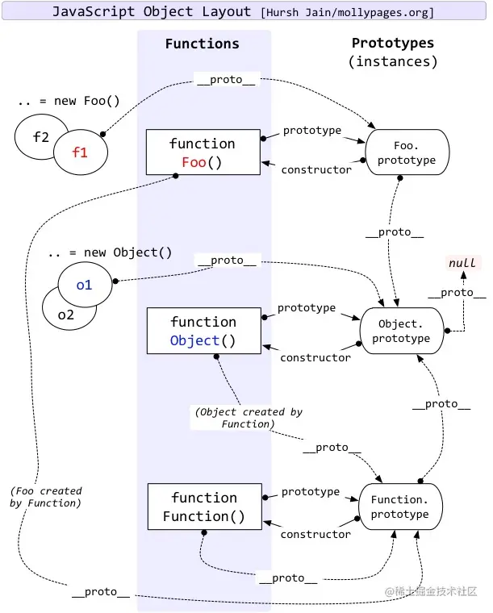

# javacript相关知识点

## 1. 模块规范
### 1.1 模块规范的目的
- **拆分代码**：按功能组织代码，提升可维护性
- **作用域隔离**：避免变量污染全局作用域
- **依赖管理**：按需加载、复用代码
### 1.2 常见模块规范对比表
| 模块规范               | 运行环境        | 加载方式              | 是否支持异步加载 | 是否支持 ES6 语法 |
| ------------------ | ----------- | ----------------- | -------- | ----------- |
| **IIFE** (立即执行函数)  | 浏览器         | 手动引入多个 `<script>` | ❌        | ❌           |
| **CommonJS**       | Node.js     | `require()` 同步    | ❌        | ❌           |
| **AMD**            | 浏览器         | 异步加载              | ✅        | ❌           |
| **CMD**            | 浏览器         | 延迟执行              | ✅        | ❌           |
| **ESM（ES Module）** | 浏览器、Node.js | 静态加载（`import`）    | ✅        | ✅           |
1. IIFE（立即执行函数表达式）模块化
```js
var moduleA = (function () {
  var msg = 'Hello'
  return {
    getMsg() {
      return msg
    }
  }
})()
console.log(moduleA.getMsg())
```
- 没有模块系统，靠闭包和函数隔离作用域
- 多个模块需要手动控制依赖和加载顺序
2. CommonJS（Node.js 模块规范）
```js
// a.js
const msg = 'Hello CommonJS'
module.exports = { msg }

// b.js
const a = require('./a')
console.log(a.msg)
```
- 使用 require() 同步加载模块
- module.exports 和 exports 暴露接口
- Node.js 默认使用的模块系统（直到 ES Module 支持）
3. AMD（Asynchronous Module Definition）
```js
// 定义模块 define
define(['dependency'], function(dep) {
  return {
    msg: 'Hello AMD'
  }
})

// 使用模块 require
require(['moduleA'], function(a) {
  console.log(a.msg)
})
```
- 代表库：RequireJS
- 适用于浏览器异步加载模块
- 缺点：语法繁琐，维护成本高
4. CMD
```js
// 定义模块
define(function(require, exports, module) {
  var dep = require('./dep')
  exports.msg = 'Hello CMD'
})
```
5. ES Module（ES6 标准模块）
```js
// a.js
export const msg = 'Hello ES Module'

// b.js
import { msg } from './a.js'
console.log(msg)
```
- 官方标准，现代浏览器 & Node.js 原生支持
- import / export 语法
- 静态分析（编译期可确定依赖）
- 静态分析（编译期可确定依赖）
- 支持异步加载（配合 type="module"）
- 模块默认是严格模式
### 1.3 Node.js 中 CommonJS 与 ESM 的区别
| 特性                | CommonJS         | ESM（ES Module）           |
| ----------------- | ---------------- | ------------------------ |
| 导入语法              | `require()`      | `import`                 |
| 导出语法              | `module.exports` | `export`                 |
| 加载方式              | 同步               | 异步（`import()`）           |
| 执行时机              | 运行时              | 编译时（静态分析）                |
| 文件扩展名             | `.js`            | `.mjs` or `type: module` |
| 是否支持 Tree-Shaking | ❌                | ✅ 静态结构可分析                |
### 1.4 AMD与CMD的区别及对比
| 模块规范   | 加载依赖                 | 执行依赖（什么时候执行 `require`） |
| ------ | -------------------- | ---------------------- |
| 🔷 AMD | **提前声明、提前加载、提前执行**依赖 | 加载模块时就执行依赖代码           |
| 🔶 CMD | **按需声明、延迟加载、延迟执行**依赖 | **等到用的时候才执行依赖代码**      |
#### AMD示例
```js
// module1.js
console.log('module1 加载并执行了')
// module2.js
console.log('module2 加载并执行了')
```
```js
// main.js (AMD)
define(['module1', 'module2'], function (m1, m2) {
  console.log('main 执行了')
})
```
- 加载module1
- 打印“module1 加载并执行了”
- 加载module2
- 打印“module2 加载并执行了”
- 打印“main 执行了”
#### CMD示例
```js
// main.js (CMD)
define(function (require, exports, module) {
  console.log('main 开始执行')

  // 用到时才加载和执行
  const m1 = require('./module1')
  const m2 = require('./module2')

  console.log('main 执行结束')
})
```
- 打印“main 开始执行”
- 引入module1，打印“module1 加载并执行了”
- 引入module2，打印“module2 加载并执行了”
#### 总结对比
| 特性   | AMD（提前执行）       | CMD（延迟执行）                 |
| ---- | --------------- | ------------------------- |
| 定义依赖 | 依赖数组一次性写出来      | 需要时再写 `require()`         |
| 加载顺序 | 一开始就加载和执行所有依赖   | 代码运行到 `require()` 时才加载并执行 |
| 适合场景 | 浏览器大项目，异步加载多个组件 | 更灵活，适合复杂逻辑，按需加载           |
| 代表库  | RequireJS       | SeaJS                     |

---

## 2. es module有哪些引入和导出方式
1. 命名导出（Named Export）
```js
// utils.js
export const name = 'Tom'
export function sayHi() {
  console.log('hi')
}
```
```js
// main.js
import { name, sayHi } from './utils.js'
sayHi()
console.log(name)
```
2. 命名导出（分开声明再导出）
```js
// config.js
const host = 'localhost'
const port = 8080
export { host, port }
```
```js
// main.js
import { host, port } from './config.js'
```
3. 命名导出（导出时重命名）
```js
// api.js
const version = 'v1'
export { version as apiVersion }
```
```js
// main.js
import { apiVersion } from './api.js'
```
4. 默认导出（Default Export）
```js
// user.js
export default {
  name: 'Alice',
  age: 30
}
```
```js
// main.js
import user from './user.js'
console.log(user.name)
```
5. 整体导入（命名空间导入）
```js
// math.js
export const sum = (a, b) => a + b
export const sub = (a, b) => a - b
```
```js
// main.js
import * as math from './math.js'
console.log(math.sum(3, 4))
console.log(math.sub(10, 3))
```
6. 仅引入模块但不使用（执行副作用）
```js
// side-effect.js
console.log('this runs automatically when imported')
```
```js
// main.js
import './side-effect.js'
```
7. 动态导入（import()）
```js
// dynamic.js
export const info = 'I am dynamic!'
```
```js
// main.js
import('./dynamic.js').then(mod => {
  console.log(mod.info)
})
```
8. 再导出（re-export）
```js
export const foo = 'foo'
```
```js
export { foo } from './a.js' // 直接转发导出
```
```js
import { foo } from './b.js'
```

## 3. require() 和 import 的本质区别
### 3.1 总结
- require() 是运行时调用、动态加载、同步执行，属于 CommonJS
- import 是编译阶段执行、静态分析、可异步加载，属于 ES Module（ESM）
### 3.2 区别
| 特性                | `require()`（CommonJS） | `import`（ES Module）        |
| ----------------- | --------------------- | -------------------------- |
| 所属模块系统            | CommonJS              | ES Module（ES6 标准）          |
| 加载时机              | **运行时**动态加载           | **编译阶段**静态解析               |
| 是否同步              | ✅ 同步加载（阻塞）            | ✅ 静态加载（默认同步），也可异步          |
| 是否支持异步加载          | ❌ 需额外手段（如动态函数）        | ✅ `import()` 本身就是异步        |
| 是否能做 Tree-shaking | ❌ 否（无法静态分析）           | ✅ 支持 Tree-shaking（静态结构）    |
| 是否支持动态路径          | ✅ 可以（路径拼接、条件判断）       | ❌ 静态 `import` 不支持动态路径      |
| 是否支持条件导入          | ✅ 支持                  | ❌ 不支持（除非用 `import()` 动态导入） |
| 是否能写在作用域内部        | ✅ 可以                  | ❌ 不可以（必须在模块顶层）             |
| 导入对象是否是引用         | ✅ 是引用（但是**值拷贝缓存**）    | ✅ 是**只读引用绑定**              |
| 是否支持循环依赖          | ✅ 支持                  | ✅ 支持，但行为更复杂（TDZ）           |
| 使用环境              | Node.js 默认支持          | 浏览器、现代 Node.js、打包工具支持      |
### 3.3 本质差异剖析
| 点          | CommonJS (`require`)    | ES Module (`import`)      |
| ---------- | ----------------------- | ------------------------- |
| **机制**     | 模块是对象（`module.exports`） | 模块是静态语法结构（变量绑定）           |
| **导入值**    | 值的拷贝（浅缓存）               | 引用绑定，导入的变量和原始模块变量**实时同步** |
| **语法特性**   | 可以写在 if、函数等作用域中         | 必须在顶层，不能动态、不能条件           |
| **模块执行顺序** | 立即执行 require            | 会提前解析依赖图，**控制顺序更明确**      |

---

## 4. require导出的值拷贝
### 4.1 理解
CommonJS 的 require 返回的是模块的值拷贝（模块对象的浅拷贝），而不是导出变量的实时引用
### 4.2 什么是“值拷贝”？
是指 被导入方修改变量，不会影响导入方

---

## 5. 闭包
### 5.1 定义
闭包是一个函数，它可以访问并记住它定义时所在作用域中的变量，即使这个函数在其词法作用域之外执行。
### 5.2 三要素
- 函数嵌套， 即外部函数嵌套一个内部函数
- 外部函数返回内部函数引用
- 内部函数使用外部函数的变量或者形参
### 5.3 例子
```js
function outer() {
  let count = 0
  return function inner() {
    count++
    console.log(count)
  }
}

const fn = outer()
fn()  // 1
fn()  // 2
```
- outer执行后返回了inner函数
- inner函数引用了外部作用域的count
- 即使 outer 已经执行完毕、其作用域应该被销毁，但由于 inner 闭包引用了这个作用域，变量 count 被保留在内存中
### 5.4 使用场景
| 场景                   | 说明                    |
| -------------------- | --------------------- |
| ✅ **数据私有化**          | 通过闭包隐藏变量，外部无法直接访问     |
| ✅ **模拟块级作用域（var时代）** | 避免变量污染                |
| ✅ **在异步回调中“记住”某个值**  | 比如在循环中绑定 `setTimeout` |
| ✅ **函数工厂（柯里化）**      | 根据不同参数创建新的函数          |

## 6. 如何使用闭包，如何避免内存泄漏
### 6.1 数据私有化
```js
function createUser(name) {
  let age = 18 // 外部访问不到

  return {
    getName() {
      return name
    },
    getAge() {
      return age
    },
    growUp() {
      age++
    }
  }
}

const user = createUser('Tom')
console.log(user.getAge()) // 18
user.growUp()
console.log(user.getAge()) // 19
```
### 6.2 定制函数工厂
```js
function makeAdder(x) {
  return function(y) {
    return x + y
  }
}

const add5 = makeAdder(5)
console.log(add5(10)) // 15
```
### 6.3 异步循环中的变量隔离
```js
for (var i = 0; i < 3; i++) {
  (function(i) {
    setTimeout(() => console.log(i), 100)
  })(i)
}
```
### 6.4 闭包可能导致内存泄漏的原因
闭包会延长函数内部变量的生命周期
- 持续引用不再需要的 DOM 节点 / 大对象
- 在事件回调或定时器中保留大量数据但忘记清理
- 循环引用闭包 + DOM 节点
#### 示例
```js
// 事件未解绑
function bindHandler() {
  const bigData = new Array(1000000).fill('*')
  const btn = document.getElementById('btn')

  btn.onclick = function () {
    console.log('clicked', bigData.length)
  }
}
```
bigData被闭包引用了，即使你从 DOM 中删除了按钮，如果没解除事件绑定，内存也不会释放
```js
// 定时器内的闭包未清理
function startTimer() { 
  const cache = new Array(1e6).fill('*')
  setInterval(() => {
    console.log('Still running', cache.length)
  }, 1000)
}
```
```js
// 全局变量 + 闭包缓存大数据
let globalFunc
function setup() {
  const bigData = new Array(1e6).fill('x')
  globalFunc = function () {
    console.log(bigData.length)
  }
}
setup()
```
### 6.5 如何避免闭包引起的内存泄漏
| 做法                     | 说明                                               |
| ---------------------- | ------------------------------------------------ |
| ✅ **及时手动解除引用**         | 比如：`btn.onclick = null`                          |
| ✅ **避免闭包引用 DOM**       | 尽量只操作 DOM，不存储 DOM                                |
| ✅ **使用弱引用（如 WeakMap）** | 避免强引用持久存在                                        |
| ✅ **闭包作用范围尽可能小**       | 不要把闭包传递得太远                                       |
| ✅ **避免全局变量闭包**         | 全局闭包最难清理和追踪                                      |
| ✅ **在组件卸载时清理定时器和事件**   | 常见于 Vue/React 中 `onUnmounted()`、`useEffect` 清理逻辑 |

## 7. 原型链
### 7.1 定义
原型链是对象访问属性时的查找路径机制：当访问一个对象属性时，如果对象本身没有这个属性，会向它的 __proto__（也就是构造函数的 prototype）一层层查找，直到找到或到达原型链的尽头（null）
### 7.2 
1. 典型结构
```js
实例对象 → 构造函数.prototype → Object.prototype → null
```
2. 示例
```js
p
↓.__proto__ → Person.prototype
               ↓.__proto__ → Object.prototype
                               ↓.__proto__ → null
```

## 8. 继承实现方式
### 8.1 原型链继承（Prototype Chain）
#### 实现方式
```js
function Parent() {
  this.colors = ['red', 'green']
}
Parent.prototype.sayHi = function () {
  console.log('Hi')
}

function Child() {}
Child.prototype = new Parent()

const c1 = new Child()
const c2 = new Child()
```
- 优点：
  - 简单、逻辑清晰
  - 方法复用（共享 prototype 方法）
- 缺点：
  - 引用类型属性共享（如数组）
  - 不能向父构造传参
### 8.2 借用构造函数继承（Constructor Borrowing）
#### 实现方式
``` js
function Parent(name) {
  this.name = name
  this.colors = ['red', 'green']
}

function Child(name) {
  Parent.call(this, name) // 关键：在子类构造函数中调用父类
}

const c1 = new Child('Tom')
const c2 = new Child('Jerry')
c1.colors.push('blue')
console.log(c2.colors) // 不受影响
```
- 优点：
  - 避免引用类型共享问题
  - 可向父类传参
- 缺点：
  - 无法继承原型上的方法（即 prototype 方法）
### 8.3  组合继承（最经典）
#### 实现方式
```js
function Parent(name) {
  this.name = name
  this.colors = ['red', 'green']
}
Parent.prototype.sayHi = function () {
  console.log('Hi')
}

function Child(name, age) {
  Parent.call(this, name) // 第一次调用
  this.age = age
}
Child.prototype = new Parent() // 第二次调用
Child.prototype.constructor = Child
```
- 优点：
  - 既能继承属性，又能继承方法
  - 实例之间互不影响
  - 支持传参
- 缺点：
  - 父构造函数调用了两次（性能浪费）
### 8.4 原型式继承（Object.create 的原理）
#### 实现方式
```js
const parent = {
  name: 'Tom',
  colors: ['red', 'green']
}

const child = Object.create(parent)
```
- 优点：
  - 语法简洁
  - 可快速创建基于原型的对象
- 缺点：
  - 引用类型共享问题仍然存在
  - 无法传参
### 8.5 寄生式继承
#### 实现方式
```js
function createChild(original) {
  const clone = Object.create(original)
  clone.sayHi = function () {
    console.log('Hi')
  }
  return clone
}
const parent = { name: 'Tom' }
const child = createChild(parent)
```
- 优点：
  - 基于原型式继承 + 增强功能
- 缺点：
  - 和原型式继承一样存在引用共享问题
  - 不是真正意义上的“构造函数”继承，无法复用
### 8.6 寄生组合继承（推荐，最佳实践，ES6的class继承本质）
#### 实现方式
```js
function Parent(name) {
  this.name = name
  this.colors = ['red', 'green']
}
Parent.prototype.sayHi = function () {
  console.log('Hi')
}

function Child(name, age) {
  Parent.call(this, name) // 只调用一次
  this.age = age
}
Child.prototype = Object.create(Parent.prototype) // 关键：不调用 Parent()
Child.prototype.constructor = Child
```
- 优点：
  - 不共享引用类型
  - 支持传参
  - 继承原型方法
  - 父构造函数只调用一次
- 缺点：
  - 写法稍微复杂一些
### 8.7 验证class实现寄生组合继承的机制
```js
// ES6 class 的原型链结构
console.log(Child.prototype.__proto__ === Parent.prototype) // true
console.log(Child.__proto__ === Parent)                     // true
```
- 构造函数继承部分：super() → Parent.call(this, ...)
- 原型链继承部分：Child.prototype = Object.create(Parent.prototype) 

---

## 9. instanceof的原理
### 9.1 基本语法
```js
object instanceof Constructor
```
判断 object 的原型链上是否能找到 Constructor.prototype
### 9.2 instanceof的原理
```js
function instanceOf(obj, constructor) {
  let prototype = constructor.prototype;
  let proto = Object.getPrototypeOf(obj);

  while (proto) {
    if (proto === prototype) {
      return true;
    }
    proto = Object.getPrototypeOf(proto);
  }

  return false;
}
```
### 9.3 对比：instanceof vs typeof vs Object.prototype.toString.call
| 方法                               | 用途     | 基本类型支持 | 跨 iframe 安全 | 能判断自定义类                      |
| -------------------------------- | ------ | ------ | ----------- | ---------------------------- |
| `typeof`                         | 基本类型判断 | ✅      | ✅           | ❌                            |
| `instanceof`                     | 原型链判断  | ❌（装箱）  | ❌           | ✅                            |
| `Object.prototype.toString.call` | 精准类型判断 | ✅      | ✅           | 部分支持（靠 `Symbol.toStringTag`） |
### 9.4 总结
- instanceof 的原理是判断一个对象的原型链上是否存在目标构造函数的 prototype
- 它是判断引用类型是否为某个构造函数“实例”的标准方法
- 在工程实践中要注意 iframe 跨域、修改原型等特殊情况
- 较复杂场景下可搭配 Object.prototype.toString.call 使用

---

## 10. isPrototypeOf 是什么
### 10.1 基本语法
```js
A.isPrototypeOf(B)
```
A是否在对象B的原型链上
### 10.2 和 instanceof 的区别
| 特性  | `instanceof`                 | `isPrototypeOf`                            |
| --- | ---------------------------- | ------------------------------------------ |
| 语法  | `obj instanceof Constructor` | `Constructor.prototype.isPrototypeOf(obj)` |
| 本质  | 检查原型链中是否包含构造函数的 prototype    | 检查某个对象是否出现在另一个对象的原型链中                      |
| 返回  | `true` / `false`             | `true` / `false`                           |
| 使用者 | 操作符                          | 对象方法                                       |
### 10.3 内部原理
```js
Object.prototype.isPrototypeOf = function (obj) {
  let proto = Object.getPrototypeOf(obj);
  while (proto) {
    if (proto === this) {
      return true;
    }
    proto = Object.getPrototypeOf(proto);
  }
  return false;
}
```

---

## 11. Object.create(null) 有原型链吗
Object.create(null) 创建的是一个**“纯净对象”**，它没有继承自 Object.prototype，因此 它没有原型链（[[Prototype]] 为 null）
### 总结
| 特性                      | `Object.create(null)`          |
| ----------------------- | ------------------------------ |
| `[[Prototype]]`         | `null`（无原型链）                   |
| 是否继承 `Object.prototype` | ❌ 否                            |
| `instanceof Object`     | ❌ false                        |
| 适合场景                    | 创建干净字典，防止原型污染                  |
| 注意事项                    | 无 `hasOwnProperty()` 等方法，需手动调用 |
### Object.create(null)、字面量 {} 和 new Object() 这三种创建对象的原型
| 创建方式                  | 原型链结构（`[[Prototype]]`）               | 是否继承 `Object.prototype` | `instanceof Object` | 备注            |
| --------------------- | ------------------------------------ | ----------------------- | ------------------- | ------------- |
| `Object.create(null)` | 直接为 `null`，无原型链                      | 否                       | false               | **无原型链、纯净对象** |
| `{}`                  | `obj.__proto__ === Object.prototype` | 是                       | true                | 最常用创建方式       |
| `new Object()`        | `obj.__proto__ === Object.prototype` | 是                       | true                | 与 `{}` 等价     |


---

## 12. typeof 和 instanceof的区别
